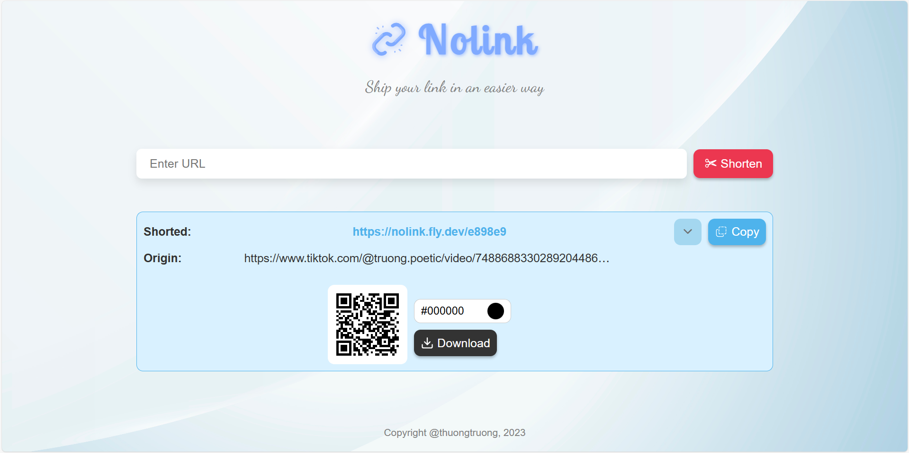
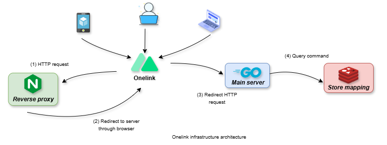

    <h1> ONELINK</h1>
    
    
    
    
    
    
    
    
     <!-- 
     -->

## Description

This is a simple URL shortener service, which helps you shorten your long URL to share repidly to external. It is written in Golang and uses Redis as database. Other hand, it also provides some services such as QR code generator, barcode generator, etc.

## Preview

## What's new

- [x] Shorten URL
- [x] Redirect to original URL
- [x] Expiration time (default 1 day)
- [x] QR code generator (custom color, download image, copy to clipboard)
- [x] Barcode generator
- [x] Statistics
- [x] Rate limit
- [x] Reverse proxy
- [x] Multi Dockerize layers
- [x] CI/CD build and deploy image
- [ ] Custom expiration time
- [ ] Unit test
- [ ] Caching

## Architecture

## Contributing

Pull requests are welcome. For major changes, please open an issue first to discuss what you would like to change. If you like my work, please star 🌟 this repository.

## License

**Short1url** is an [MIT-licensed](LICENSE) open source project.

Copyright of <a href="https://github.com/thuongtruong1009">thuongtruong1009</a>

<!-- ## References

[Ref1](https://liamhieuvu.com/url-shortener-with-golang-and-mysql)
[Go on K8s](https://www.callicoder.com/deploy-multi-container-go-redis-app-kubernetes/)
[Nginx cache](https://vietnix.vn/cau-hinh-cache-nginx/)
[Nginx refs](https://github.dev/veryacademy/yt-nginx-mastery-series)
-->
